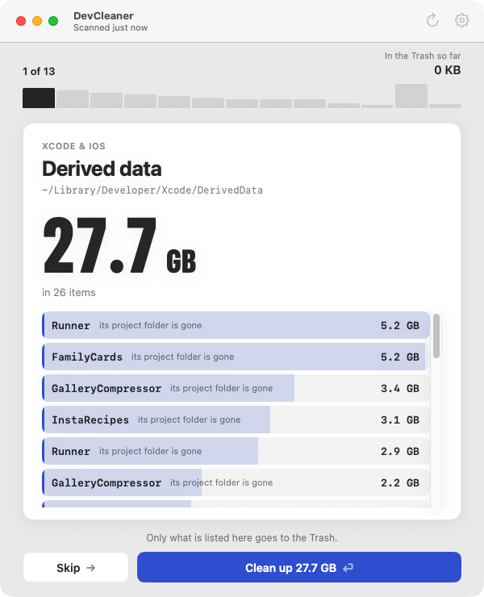

# DevCleaner

A macOS app that gets disk space back on a developer's Mac, one decision at a time.

<p>
  
  
</p>

## How it works

- The window shows one card at a time. Biggest first.
- Each card says what would go, how much space it frees, and how it comes back.
- Two buttons: **Skip** or **Clean up**. Press Return to clean, the right arrow to skip.
- Keep going until there is nothing left to decide.

## What it cleans

- Project build folders: `build`, `.build`, `Pods`, `node_modules`, `.dart_tool`
- Xcode: derived data, archives, old device support, simulators and runtimes
- Tool caches: Android and Gradle, Flutter and Dart, CocoaPods, npm, pnpm, bun, SwiftPM
- Big things: forgotten downloads, AI models, and a "Large files" page with checkboxes

## It is careful

- Your code stays. Folders that rebuild themselves go to the Trash.
- Your own files always go to the Trash, and only when you click.
- It leaves alone what you are using: pinned projects, the simulator and emulator you run, the SDK versions your projects need.

Everything happens on your Mac. No network, no telemetry. There is also a command line, `devcleaner scan`, if you would rather just look.

## Install

Needs macOS 14 or later and a Swift 6 toolchain.

```sh
./Scripts/make-app.sh release
```

Move `build/DevCleaner.app` to your Applications folder. The app is not notarized, so the first time you open it, right-click the app and choose Open.

## License

Apache 2.0 — see [LICENSE](LICENSE).
